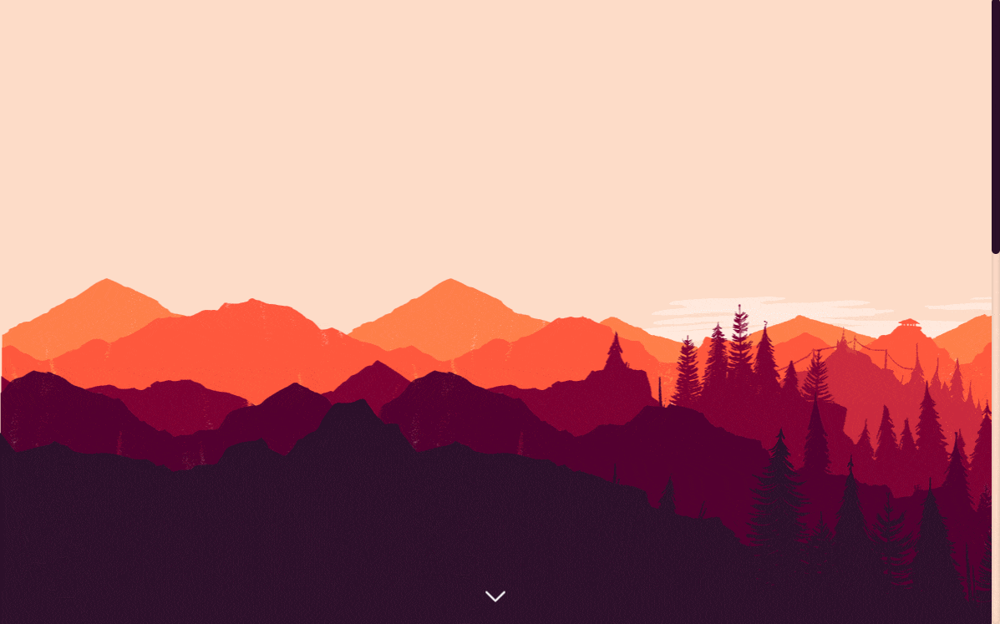
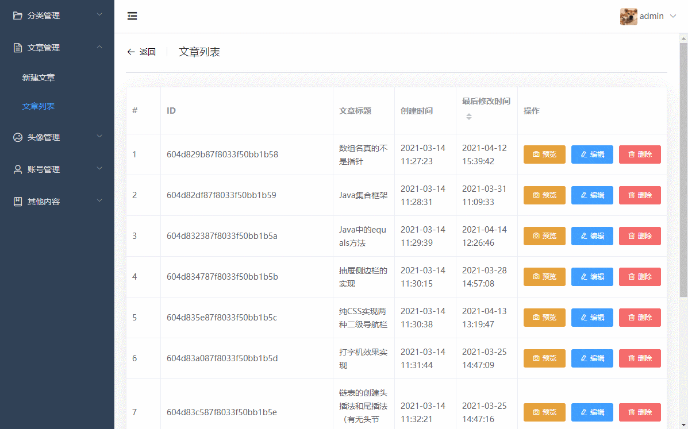
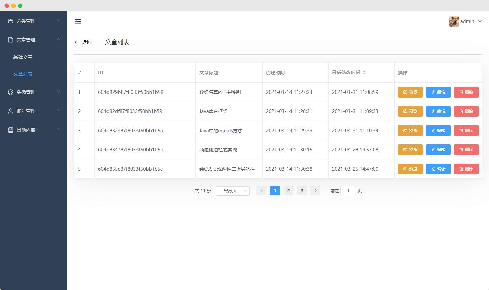
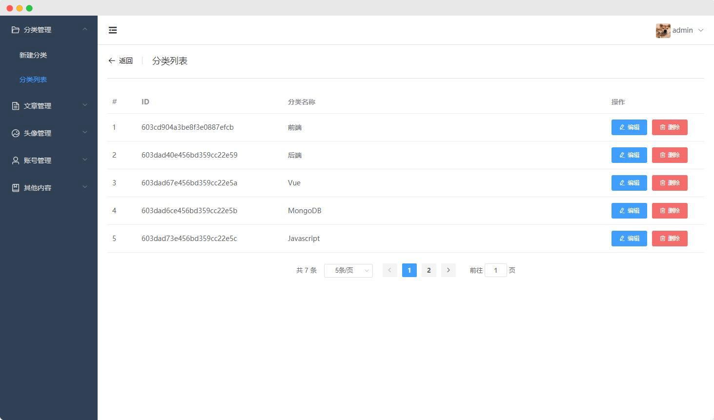
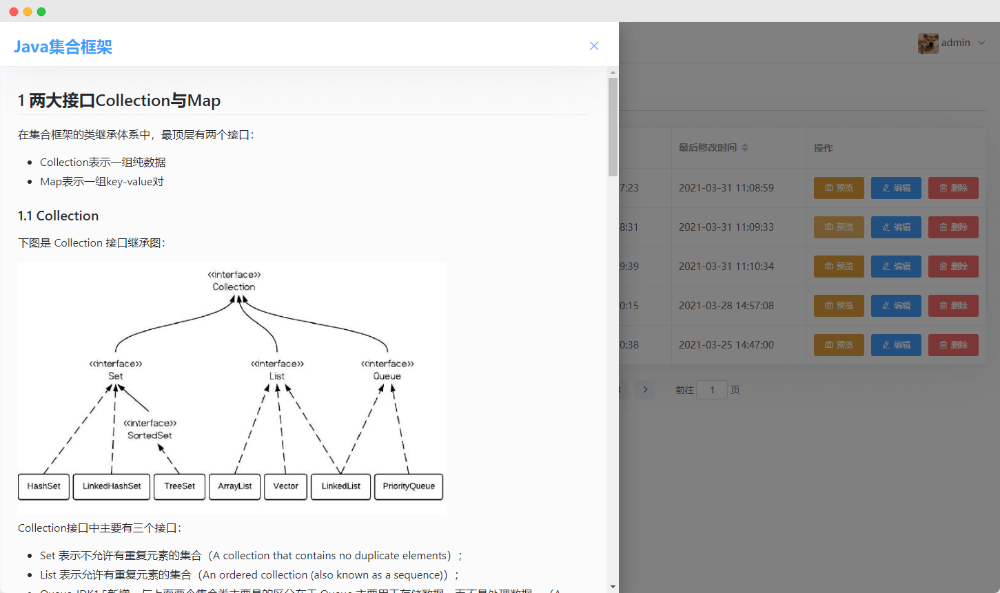
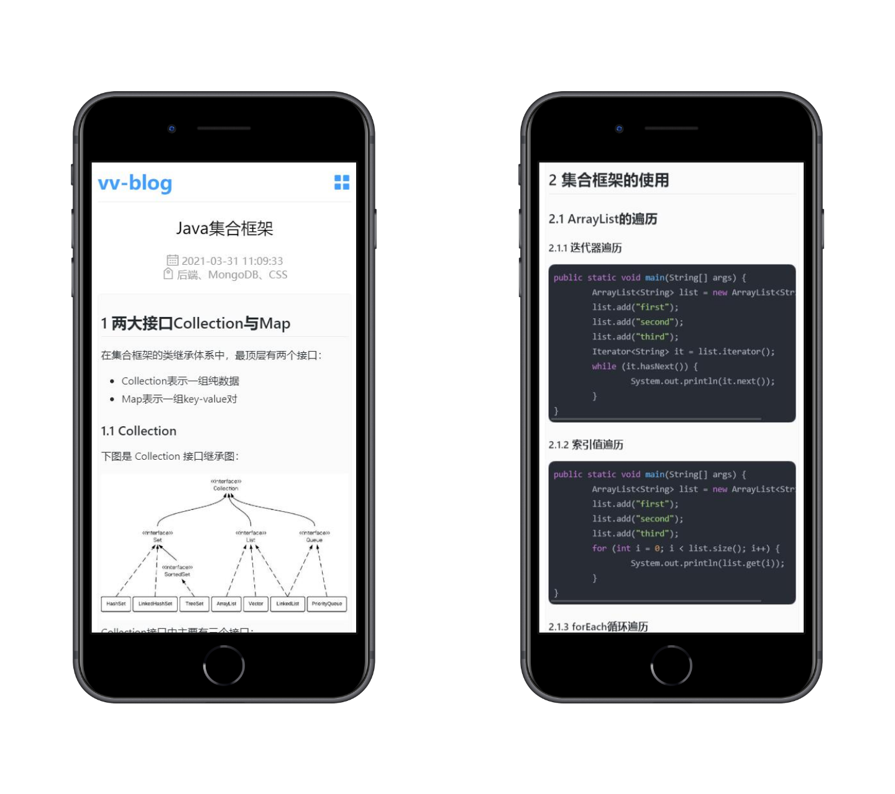

<p align="center">
  <a href="https://github.com/syzdev/vv-blog" target="blank">
    
  </a>
</p>
<p align="center">
  <a href="https://github.com/vuejs/vue">
    
  </a>
  <a href="https://github.com/ElemeFE/element">
    
  </a>
  <a href="https://github.com/expressjs">
    
  </a>
  <a href="https://github.com/mongodb/mongo">
    
  </a>
  <a href="https://github.com/nodejs/node">
    
  </a>
  <a href="https://opensource.org/licenses/MIT">
    
  </a>
</p>


# 🖥️ 环境

- [Vue.js](https://www.npmjs.com/package/vue/v/2.6.11) ^2.6.11
- [element-ui](https://github.com/ElemeFE/element) ^2.4.5
- [express](https://www.npmjs.com/package/express/v/5.0.0-alpha.8) ^5.0.0-alpha.8
- [MongoDB](https://www.mongodb.com/) 4.4.4
- [node.js](https://nodejs.org/zh-cn/download/) 12.18.4

# 📦️ 安装

1. 下载安装`Node.js`和`MongoDB`；

2. 将项目克隆到本地；

   ```shell
   # 克隆到本地
   git clone https://github.com/syzdev/vv-blog.git
   ```

3. 分别进入`admin`、`server`及`web`目录下，这三个目录分别对应后台管理端、服务端及博客端，执行以下命令：

   ```shell
   # 安装
   npm install
   
   # 启动
   npm run serve
   ```


# 🖼️ 截图
## 📝 博客页面


## 💻 后台管理页面





## 📱 移动端页面


# 📜 开源许可
MIT License
