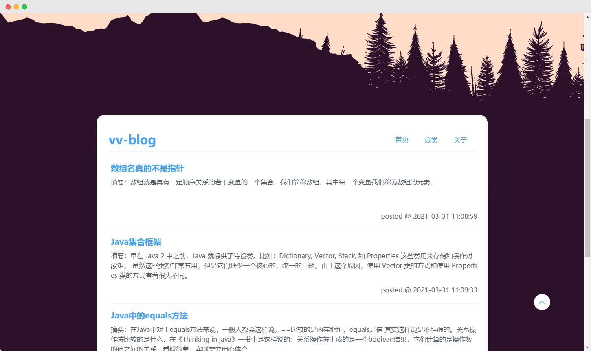

<p align="center">
  <a href="https://github.com/syzdev/vv-blog" target="blank">
    
  </a>
</p>

<p align="center">
  <a href="https://github.com/vuejs/vue">
    
  </a>
  <a href="https://github.com/ElemeFE/element">
    
  </a>
  <a href="https://opensource.org/licenses/MIT">
    
  </a>
</p>

# 💻 环境

- [Vue.js](https://www.npmjs.com/package/vue/v/2.6.11) ^2.6.11
- [element-ui](https://github.com/ElemeFE/element) ^2.4.5
- [Express](https://www.npmjs.com/package/express/v/5.0.0-alpha.8) ^5.0.0-alpha.8
- [MongoDB](https://www.mongodb.com/) 4.4.4
- [Node.js](https://nodejs.org/zh-cn/download/) 12.18.4

# 📦️ 安装

下载安装`Node.js`和`MongoDB`，分别进入`admin`、`server`及`web`目录下，执行以下命令：

```shell
# 1.克隆到本地
git clone https://github.com/syzdev/vv-blog.git

# 2.分别进入上述三个目录中安装
npm install

# 3.分别进入上述三个目录中启动
npm run serve
```
# 🖼️ 截图




# 📜 开源许可
MIT License
